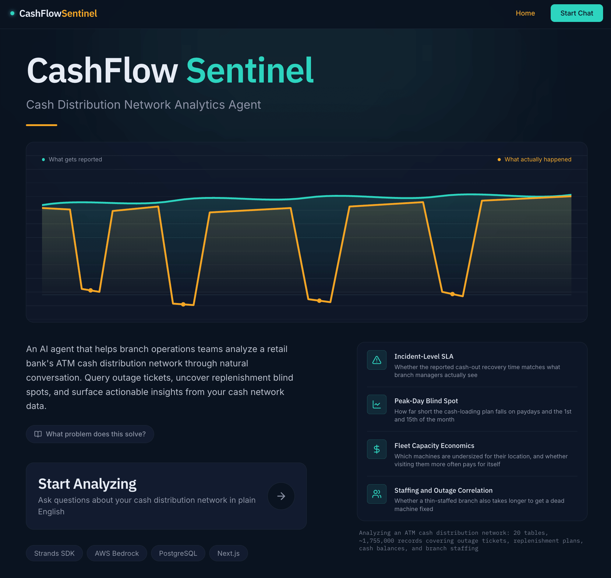
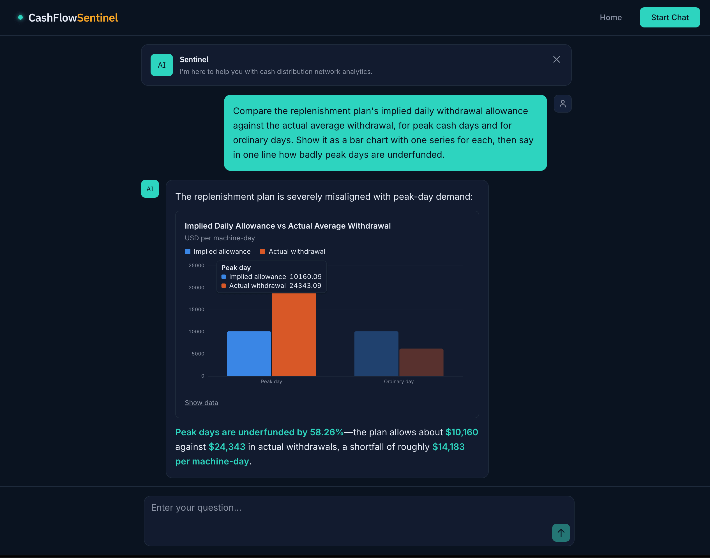
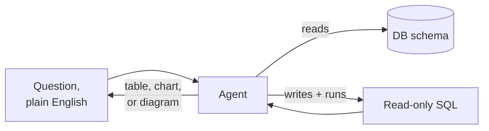

# AI Agent App

[](https://junyao-retail-banking-cash-distribu.vercel.app/)
[](https://nextjs.org)
[](https://www.python.org)
[](https://fastapi.tiangolo.com)
[](https://neon.tech)
[](https://vercel.com)

**An AI agent that reads a real multi-table database, writes its own SQL against it, and answers business questions in plain English — with a table, a chart, or a diagram, whichever actually fits the question.**

**🔗 Live demo:** [junyao-retail-banking-cash-distribu.vercel.app](https://junyao-retail-banking-cash-distribu.vercel.app/)

Ask it something a single query can't answer and it works out which tables to join, writes the SQL, runs it, and explains what came back in business terms instead of handing you a grid of numbers. Every layer — backend, frontend, database, deployment — is genuinely wired together and live, not stubbed out.

<p align="center">
  
  
</p>

## What ships by default

Ask a question in plain English and the agent:

1. Reads a compressed, LLM-tuned description of the database schema — never a raw data dump
2. Writes its own SQL and runs it inside a transaction that is **always rolled back**, so read-only is a property of the transaction, not a keyword blacklist
3. Picks how to answer: a **table** when you need the numbers, a **chart** when the shape of the numbers is the point, a **diagram** when the answer is about how something flows
4. Explains the result in business language, and can show you the SQL and its own reasoning on request



The mapping between a trigger phrase in the prompt and the render block it produces is a **contract checked in both directions** — a mismatch fails the build instead of shipping a chart icon over a paragraph of prose.

## Built on

| Layer | Stack |
| :--- | :--- |
| Backend | Python, FastAPI, [Strands Agents SDK](https://github.com/strands-agents/sdk-python) |
| Frontend | TypeScript, Next.js, deployed on Vercel |
| Database | PostgreSQL ([Neon](https://neon.tech)) — the same schema locally and in production, no SQLite fallback to drift from it |
| Model | OpenAI, Anthropic, Google Gemini, or AWS Bedrock — a single environment variable, no rebuild |

## Running it locally

```bash
cp .env.example .env        # fill in exactly one LLM provider's key, plus the database
mise run inst                # install Python (uv) and Node (pnpm) dependencies
mise run dev                 # Next.js on :3000, FastAPI on :8000
```

Open `localhost:3000` and start asking questions.
