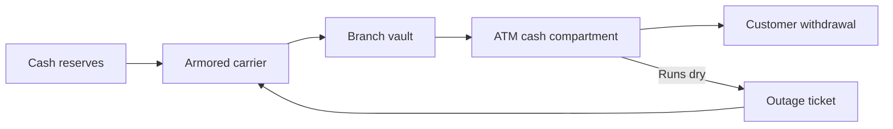

<!--
The long-form explainer behind the home page's one-paragraph pitch.

Opened from the home page and dismissed again without navigating. It exists
because a headline and one paragraph cannot carry a whole business domain, and
a reader who does not already know the industry will otherwise not understand
what any of the agent's answers are for.

It describes the **app**, not the dataset. What ships outward looks like a
dataset with an agent attached, but what a reader actually needs is what the
app is for: whose problem it solves, on what evidence, and how far it goes
today. The first three sections explain the world, the last three explain what
the agent does in it.

Written for a stranger with no domain knowledge and no context about who built
this: the industry, not an employer; the problem, not a project. Common sense
should be enough to follow every sentence.

The title and subtitle above it live in `site.toml` under
`[home.businessContext]`, because they label the control that opens this.

At most one mermaid diagram in the whole file, under ten nodes.
-->

## How a community bank's cash network earns and spends

The model is the ordinary one for a regional retail bank: take in deposits at a low cost, lend the money out again for mortgages and small business loans at a higher rate, and keep the difference. Fee income from accounts and ATM surcharges adds a smaller slice on top.

Running hundreds of ATMs and branches is not a revenue line at all. It is a pure cost center, and it is the one part of the cost structure a customer feels directly. A borrower does not notice a mortgage rate that moved by a tenth of a point. A customer absolutely notices standing at an empty ATM on the Friday their paycheck lands, and there is a real chance they open an account across the street the next week.

- **Armored-carrier visits.** Every scheduled stop to reload a machine costs a flat fee. An unplanned emergency stop, dispatched because a machine ran dry outside its normal route, costs roughly three and a half times as much.
- **Idle cash.** Every dollar sitting in a cash compartment or a branch vault earns nothing while it sits there. Load a machine with more than it needs and that money is doing nothing but taking up space in an armored truck's insurance coverage.
- **Branch labor on the days everyone shows up at once.** Paydays and the first and middle of the month bring several times the ordinary teller traffic, and a branch that cannot staff up for those days pays for it in slower service and more errors, not in a line item anyone tracks separately.

## Where the money quietly leaks

None of the following show up as a line item on a monthly report. Each one is structural, a byproduct of how the systems and processes were built, and each stays invisible unless somebody deliberately goes looking. That is what this agent is for.

- **The headline service number is inflated by how the ticketing system cleans up after itself.** Every night, two automated jobs close out whatever cash-out tickets are still open and let a fresh one get opened the next morning if the machine is still dead. Each of those short tickets individually meets its deadline, so a machine that was actually empty for two days shows up in the report as three separate short outages, all compliant. Nothing about that looks like an error, because nothing failed. It is the intended behavior of a cleanup job doing exactly what it was built to do.
- **The cash-loading formula has no idea what day it is.** It sizes every delivery from the past month's average withdrawals, a number that treats a payday Friday exactly like a quiet Tuesday. The shortfall only shows up as a spike in outage tickets on the days that matter most, never as a line in the formula itself, because the formula was never wrong on its own terms. It just never had a term for the calendar.
- **Some machines are the wrong size for where they sit, and nothing flags it.** When the formula calculates more cash than a machine's compartment can physically hold, the system quietly loads what fits and moves on. There is no error, no alert, and no automatic escalation to replace the machine. The problem only becomes visible if someone cross-references the plan against the machine's physical limit, which nothing does by default.
- **A short-staffed branch is slower to authorize the fix, and that delay hides inside a routine approval step.** Sending out an emergency cash delivery needs a manager's sign-off, and a thinly staffed branch takes longer to give it. Nobody times that approval separately, so a branch's staffing trouble surfaces as a slightly longer outage on its ATMs, not as a staffing metric anyone would think to check first.

## What this looks like in the data

Proving any one of these leaks means putting several things side by side that nobody normally looks at together: the outage record, the loading plan that was in force that day, and the calendar. Look at the outage tickets alone and every one of them meets its deadline. Look at the loading plan alone and every delivery was calculated correctly from its own formula. Only once the two are lined up against the calendar does the mismatch appear.

So the record covers two full years together: every ATM's daily cash balance and every outage ticket it raised, every cash-delivery plan and every actual carrier visit, and every branch's staffing plan against who actually showed up. The reference point for anything phrased as "as of today" is fixed at January 12, 2026, two weeks after the two years of data end, so the same question returns the same answer every time it is asked.

## What the agent does with it

You ask in plain English. The agent reads the database structure, works out which tables have to be joined and at what grain, writes the query, runs it, and then explains what came back in business terms rather than handing you a grid of numbers.

It picks its format to match the question. Exact values arrive as a table. When the shape of the numbers is the point, such as a ranking across carriers, a gap between what was planned and what happened, or a trend across months, it draws a chart. When the answer is about how something flows or where a count goes at each stage, it draws a diagram.

Every number it reports comes from a query it actually ran against the data, not from its own recollection. If you want to check it, ask it to show you the SQL and the reasoning; it keeps both.

## What you can ask, and how to read the answers

Almost every useful question falls into one of four groups. You do not need to phrase them precisely or know any table names.

- **Incident-level SLA.** How the reported service-level number compares with the real recovery time once same-machine tickets that reopen quickly are merged back into one outage, and which carriers or regions depend on the split the most.
- **Peak-day blind spot.** How far the cash-loading plan's assumptions fall short on paydays and the first and middle of the month, and what that costs in both outages and idle cash on ordinary days.
- **Fleet capacity economics.** Which machines are undersized for their location, how much of the fleet is affected, and whether visiting a problem machine more often is actually worth what it costs.
- **Staffing and outage correlation.** Whether thinly staffed branches take longer to recover a dead machine, and whether that branch actually tried to schedule for the peak in the first place.

Two habits make the answers far more useful. First, a network-wide average hides the finding: the reported service level and the real one are both averages of carriers or regions that are fine and ones that are not, and averaging them back together erases exactly the gap this agent exists to find. Ask for the breakdown, not the mean.

Second, a service-level number can improve because the target moved, not because anything on the ground changed. A carrier's contract can be renegotiated to a longer deadline in the same year a region's real outage hours got worse. Always check whether the threshold itself changed before treating an improved number as good news.

## Beyond read-only

This app only reads. It can query anything in the record and explain it, but it cannot change a single row. That is a deliberate choice for something anyone can open, not a limitation of what the approach can do.

The same architecture supports the other half. An agent can be given tools that act rather than only report: open an emergency replenishment ticket for a machine that is about to run dry, queue a machine's replenishment frequency for review at the next planning cycle, or flag a branch's staffing plan for the regional manager. The analysis and the action then live in one place, instead of ending in a slide deck that someone has to act on by hand a week later.

That step is only responsible with two things attached. Guardrails: an agent gets narrowly scoped permissions, and the consequential actions need human approval rather than a broad key and good intentions. An auditable trail: every action it takes is attributable, reviewable, and reversible after the fact. An agent that can act without both is not a more capable product, it is an unaccountable one. That is why what you are looking at here stops at read-only.
